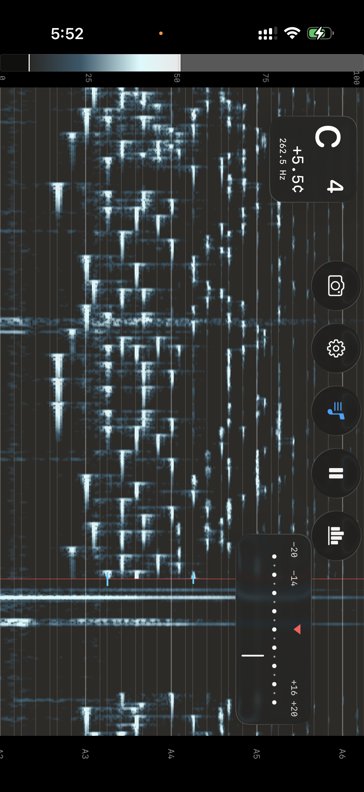

# EasySpectrogram
An easy to use spectrogram for Apple platforms

While under the influence of a certain anime, plus I've always had a facination with spectrograms, I decided to make this app. I believe this is the best implimentation there is, existing products regardless of what they can do, are firstly full of ad banners and pop-ups begging you to subscribe or try free for 7 days, there will be no such annoyance in Easy Spectrogram.

The crowning feature right now is probably the pitch detector, it is perhapse the stickiest real time pitch detector there is, it magnitizes to voices and instruments extremely well. The screenshot above also shows a new feture not yet in the live build, a special algorithm that can extract precise pitch data from FFTs. This two-stage algorithm boosts accuracy by up to 100x in lower ranges like A2, equivalent to about 0.35cents, better than regular tuners. This is not just a tuner algorithm bolted on, it extract the pitch of whatever note visually indicated on the spectrogram, and it reacts instanteneously to new spectrogram updates.

The interface is designed to be user friendly, the icons and text always rotate while the graph does not, much like a camera app, yet it still flips the graph around if you decide to go landscape the other way. This is because the microphone is on the bottom so you might want to point it ina desired direction.

Instead of traditional nerdy perameters like "FFT size" or "db Gain", this app is designed to be as easy and straight forward as possible. FFT size is translated into "frequency resolution" or bin size, where it is easy to understand that smaller number means more frequency domain resolution. There are no gain settings either, the gradient scale itself is your dynamic range adjustment, you switch over to the spectrum bar view, visually adjust the start and end point to the height you want, referecing the real time data being displayed, and the spectrogram will be calibrated to utilize the full range in a matter of seconds, no menus no numbers no guess work.

All of this has been accomplished with attention to performance, this app can run continously on an iPhone Air without any detectable heat up, the phone remaigns cold and system power draw is in the range of 1w. 

This app is now available for free on the App Store, may this help you discover your passion in music or science. 北宇治ファイル!
